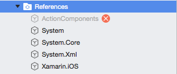

# About Action Tray

**Action Tray** is a dockable, customizable, slide-out, tray view controller for iOS and Android that can be attached to the top, left, bottom or right sides of the screen. **Action Tray** supports three tray types:

* **Draggable** – The user can drag the tray out from the edged anywhere between its open and closed positions or double tap it to snap between open and closed.
* **Popup** – The tray will snap between its open and closed positions when its Drag Tab is touched.
* **AutoClosingPopup** – Just like the Popup tray but it will also close if the user taps its content area.

# Running the Samples

Before you can successfully build and run these sample apps, you'll need to download and install the [Action Components Trial](http://appracatappra.com/products/action-components/) version from the Appracatappra website or have purchased and installed a licensed version of the components.

Next, open either the iOS or the Android version of the sample in Visual Studio and expand the **Resources** folder:



If the `ActionComponents` entry is grayed-out with a red X (as shown in the image above), right-click on it and select **Delete**. Double-Click the **Resources** folder to open the **Edit References** dialog and select the **.Net Assembly** tab:


Click the **Browse** button, navigate to where you installed the **Action Components** trial or licensed version and locate the appropriate `ActionComponents.ddl` (for either iOS or Android) and click the **OK** button. The sample will now be ready to run.

# Use Alone or in Groups

You can place individual **Action Trays** along any edge of the screen or place several **Action Trays** together and attach them to an **ActionTrayManager** to control them as a group and use them like palettes or menus. The **ActionTrayManager** provides events to respond to user interaction in any of the trays it controls and it automatically ensures that only one tray in the group is open at a time.

# Events

**Action Tray** defines the following events that you can monitor and respond to:

* **Touched**
* **Moved**
* **Released**
* **Opened**
* **Closed**
* **Appearance**

**Action Tray** is fully customizable with user definable appearances for every element of its UI. Action Tray supports the following Drag Tab types:

* **Plain** – An empty Drag Tab.
* **GripOnly** – A 3 line grip in the Drag Tab.
* **GripAndText** – A 3 line grip and a title in the Drag Tab.
* **TitleOnly** – Only the title in the Drag Tab.
* **IconOnly** – Only an icon in the Drag Tab.
* **IconAndTitle** – An icon and title in the Drag Tab.
* **CustomDrawn** – Allows for a totally custom drawn Drag Tab.

You can also position where the Drag Tab appears on the **Action Tray** as one of the following:

* **TopOrLeft** – Appears on the top or left side of the **Action Tray** based on its orientation.
* **Middle** – Appears in the middle of the **Action Tray**.
* **BottomOrRight** – Appears on the bottom or right side of the **Action Tray** based on its orientation.
* **Custom** – You can control the position of the Drag Tab by setting the tabOffset property of the **Action Tray**.

# Features

**Action Tray** includes a fully documented API with comments for every feature. The **Action Tray** user interface is drawn with vectors and is fully resolution independent.

# iOS Example

**Action Tray** was designed to make adding it to a project super easy. Take a look at the following example of using a tray added in a `.xib` file:

```csharp
using ActionComponents;
...

public override void ViewDidLoad ()
{
    base.ViewDidLoad ();

    ...

    // Wireup the left side tray created in the .xib file and style
    // it to be a drag out tray.
    if (leftTray != null) {
        // Set tray type
        leftTray.orientation = ACTrayOrientation.Left;
        leftTray.tabLocation=ACTrayTabLocation.BottomOrRight;
        leftTray.frameType=ACTrayFrameType.EdgeOnly;
        leftTray.tabType=ACTrayTabType.IconAndTitle;

        // Style tray
        leftTray.appearance.background=UIColor.LightGray;
        leftTray.appearance.frame=UIColor.DarkGray;
        leftTray.icon=UIImage.FromFile ("Images/icon_calendar.png");
        leftTray.title="Events";
        leftTray.appearance.tabAlpha=0.25f;
        leftTray.CloseTray (false);

        // Respond to the tray being touched
        leftTray.Touched+= (tray) => {
            // Are we on an iPhone?
            if (UserInterfaceIdiomIsPhone) {
                //Yes, close this tray and animate the closing
                rightTray.CloseTray (true);
            }

            // Tell any open palette trays to close
            trayManager.CloseAllTrays ();

            // Close document tray
            if (documentTray!=null) 
                documentTray.CloseTray (true);
        };
    }

    // Wireup the right tray created in the .xib file and style it
    // to be a popup tray. Touch it's dragTab to open and close it.
    if (rightTray != null) {
        // Are we on an iPhone?
        if (UserInterfaceIdiomIsPhone) {
            // Move the subview into view and attach it to the master view
            rightTray.MoveTo (new PointF(320f-rightTray.Frame.Width,0f));
            View.AddSubview(rightTray);

            // iPhone specific settings
            rightTray.tabLocation=ACTrayTabLocation.BottomOrRight;
        }

        // Set tray type
        rightTray.trayType=ACTrayType.Popup;
        rightTray.orientation=ACTrayOrientation.Right;
        rightTray.bringToFrontOnTouch=true;
        if (UserInterfaceIdiomIsPhone) rightTray.CloseTray(false);

        // Style the tray
        rightTray.appearance.background=UIColor.DarkGray;

        // Respond to the tray being opened
        rightTray.Opened+= (tray) => {
            //Are we on an iPhone?
            if (UserInterfaceIdiomIsPhone) {
                //Yes, close this tray and animate the closing
                leftTray.CloseTray (true);
            }

            // Tell any open palette trays to close
            trayManager.CloseAllTrays ();

            // Close document tray
            if (documentTray!=null) 
                documentTray.CloseTray (true);
        };
    }

    ...

}
```

**NOTE**: **Action Trays** and the `UIViews` that they control can be completely created in C# code without using `.storyboard` or `.xib` files.

# Android Example

**Action Tray** was designed to make adding it to a project super easy. Start an Android project in Visual Studio, switch to the Android Designer and add a `RelativeLayout` to be the parent of the `ActionTab`. Add one or more `Views`, switch to the Source view and change their type to ActionComponents.ACTray. Wire-up their functionality inside your Main Activity:

```csharp
using ActionComponents;
...

[Activity (Label = "ActionTrayTest.Android", MainLauncher = true)]
public class Activity1 : Activity
{
    #region Private Variables
    private ACTray leftTray, rightTray, toolsTray, propertyTray, paletteTray, documentTray;
    #endregion 

    #region Public Variables
    public ACTrayManager trayManager;
    #endregion

    #region Override Methods
    protected override void OnCreate (Bundle bundle)
    {
        base.OnCreate (bundle);

        // Set our view from the "main" layout resource
        SetContentView (Resource.Layout.Main);

        // Gain Access to all views and controls in our layout
        leftTray = FindViewById (Resource.Id.trayLeft);
        rightTray = FindViewById (Resource.Id.trayRight);
        toolsTray = FindViewById (Resource.Id.trayTools);
        propertyTray = FindViewById (Resource.Id.trayProperty);
        paletteTray = FindViewById (Resource.Id.trayPalette);
        documentTray = FindViewById (Resource.Id.trayDocuments);

        // Create a TrayManager to handle a collection of "palette"
        // trays. It will automatically close any open tray when 
        // another tray in this collection is opened.
        trayManager = new ACTrayManager ();

        // Automatically close the left and right trays when any tray
        // in the manager's collection is opened
        trayManager.TrayOpened += (tray) => {
            // Animate the trays being closed
            leftTray.CloseTray (true);
            rightTray.CloseTray (true);
        };

        // Setup the left side tray
        leftTray.trayType = ACTrayType.Draggable;
        leftTray.orientation = ACTrayOrientation.Left;
        leftTray.tabLocation = ACTrayTabLocation.BottomOrRight;
        leftTray.frameType = ACTrayFrameType.EdgeOnly;
        leftTray.tabType = ACTrayTabType.IconAndTitle;
        leftTray.bringToFrontOnTouch=true;

        // Style tray
        leftTray.appearance.background = Color.Gray;
        leftTray.appearance.border = Color.Red;
        leftTray.icon = Resource.Drawable.icon_calendar;
        leftTray.title = "Events";
        leftTray.appearance.tabAlpha=100;
        leftTray.CloseTray (false);

        // Respond to the left tray being touched
        leftTray.Touched+= (tray) => {
            //Yes, close this tray and animate the closing
            rightTray.CloseTray (true);

            // Tell any open palette trays to close
            trayManager.CloseAllTrays ();

            // Close document tray
            documentTray.CloseTray (true);
        };

        // Setup the right side tray
        rightTray.trayType = ACTrayType.Popup;
        rightTray.orientation = ACTrayOrientation.Right;
        rightTray.bringToFrontOnTouch = true;
        rightTray.CloseTray (false);

        // Respond to the tray being opened
        rightTray.Opened+= (tray) => {
            //Close this tray and animate the closing
            leftTray.CloseTray (true);

            // Tell any open palette trays to close
            trayManager.CloseAllTrays ();

            // Close document tray
            documentTray.CloseTray (true);
        };

        // Set tray type
        documentTray.trayType = ACTrayType.AutoClosingPopup;
        documentTray.orientation = ACTrayOrientation.Bottom;
        documentTray.tabType = ACTrayTabType.GripAndTitle;
        documentTray.bringToFrontOnTouch=true;

        // Style tray
        documentTray.tabWidth = 125;
        documentTray.appearance.background = Color.Gray;
        documentTray.title = "Documents";
        documentTray.CloseTray (false);

        // Respond to the tray being opened
        documentTray.Opened += (tray) => {
            // Close left and right trays
            leftTray.CloseTray(true);
            rightTray.CloseTray(true);
        };

        //--------------------------------------------------------------------------------------
        // Create three action tray's and use them as a collection via an Action TrayManager
        //--------------------------------------------------------------------------------------

        //--------------------------------------------------------------------------------------
        // Palette 1
        // Set tray type
        paletteTray.trayType = ACTrayType.AutoClosingPopup;
        paletteTray.orientation = ACTrayOrientation.Top;
        paletteTray.tabLocation = ACTrayTabLocation.TopOrLeft;
        paletteTray.tabType = ACTrayTabType.IconAndTitle;
        paletteTray.CloseTray (false);

        // Style tray
        paletteTray.tabWidth = 125;
        paletteTray.appearance.background = Color.Gray;
        paletteTray.icon = Resource.Drawable.icon_palette;
        paletteTray.title="Palette";

        // Add this tray to the manager's collection
        trayManager.AddTray (paletteTray);

        //--------------------------------------------------------------------------------------
        // Palette 2
        // Setup property tray type
        propertyTray.trayType = ACTrayType.Popup;
        propertyTray.orientation = ACTrayOrientation.Top;
        propertyTray.tabLocation = ACTrayTabLocation.TopOrLeft;
        propertyTray.tabType = ACTrayTabType.IconAndTitle;
        propertyTray.CloseTray (false);

        // Style tray
        propertyTray.tabWidth = 125;
        propertyTray.appearance.background = Color.Rgb (38,38,38);
        propertyTray.icon=Resource.Drawable.icon_measures;
        propertyTray.title="Properties";

        // Add this tray to the manager's collection
        trayManager.AddTray (propertyTray);

        //--------------------------------------------------------------------------------------
        // Palette 3
        // Setup tools tray type
        toolsTray.trayType = ACTrayType.AutoClosingPopup;
        toolsTray.orientation = ACTrayOrientation.Top;
        toolsTray.tabType = ACTrayTabType.IconOnly;
        toolsTray.CloseTray (false);

        // Style tools tray
        toolsTray.tabWidth = 50;
        toolsTray.tabLocation = ACTrayTabLocation.BottomOrRight;
        toolsTray.appearance.background = Color.Rgb (38,38,38);
        toolsTray.icon = Resource.Drawable.icon_pencil;

        // Add this tray to the manager's collection
        trayManager.AddTray (toolsTray);
    }

    protected override void OnSaveInstanceState (Bundle outState)
    {
        //Save the state of all trays on the screen
        outState.PutString("leftTray",leftTray.SaveState);
        outState.PutString("rightTray",rightTray.SaveState);
        outState.PutString("documentTray",documentTray.SaveState);
        outState.PutString("paletteTray",paletteTray.SaveState);
        outState.PutString("propertyTray",propertyTray.SaveState);
        outState.PutString("toolsTray",toolsTray.SaveState);

        base.OnSaveInstanceState (outState);
    }

    protected override void OnRestoreInstanceState (Bundle savedInstanceState)
    {
        //Restore all trays to their previous states
        leftTray.RestoreState(savedInstanceState.GetString("leftTray"));
        rightTray.RestoreState(savedInstanceState.GetString("rightTray"));
        documentTray.RestoreState(savedInstanceState.GetString("documentTray"));
        paletteTray.RestoreState(savedInstanceState.GetString("paletteTray"));
        propertyTray.RestoreState(savedInstanceState.GetString("propertyTray"));
        toolsTray.RestoreState(savedInstanceState.GetString("toolsTray"));

        base.OnRestoreInstanceState (savedInstanceState);
    }
    #endregion 
}
```

# Trial Version

The Trial version of **Action Tray** is fully functional however the background is watermarked. The fully licensed version removes this watermark.
